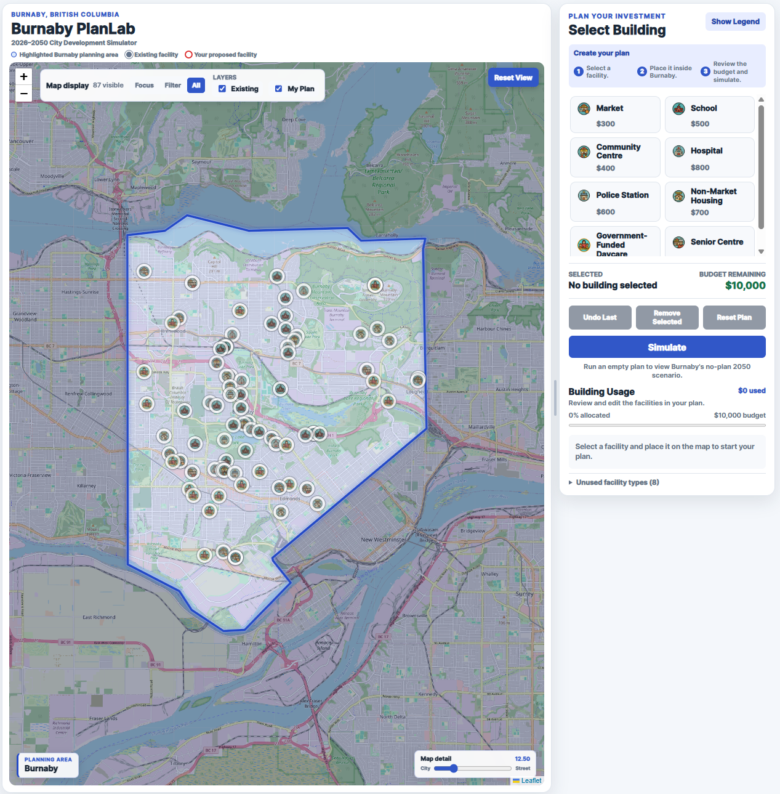
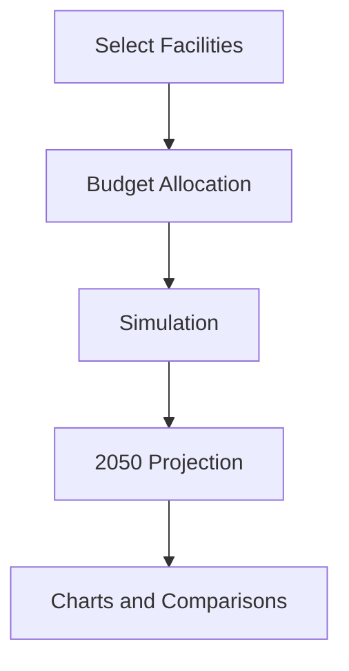
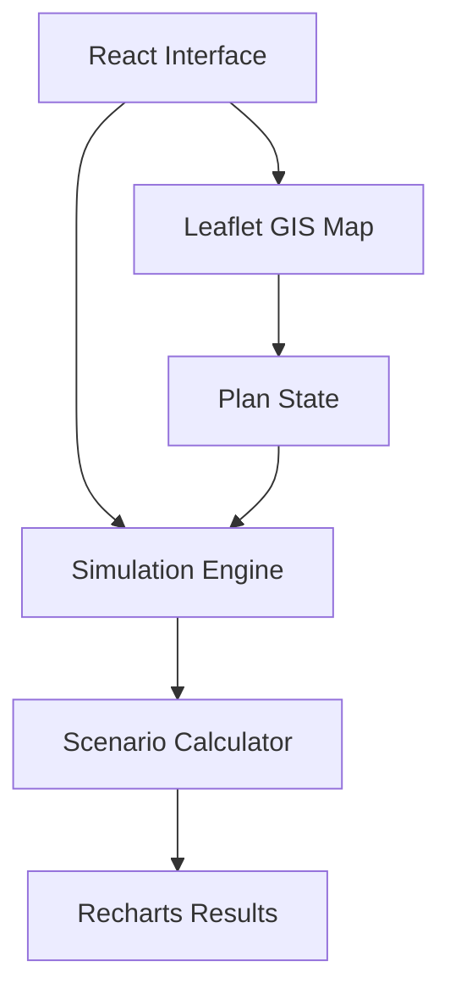

# Burnaby PlanLab

Interactive 2026–2050 city-development simulator for Burnaby, British Columbia.

[](https://github.com/kbyunghak/Burnaby-PlanLab/actions/workflows/ci.yml)
[](https://kbyunghak.github.io/Burnaby-PlanLab/)

## Overview

Burnaby PlanLab lets users place proposed facilities inside the Burnaby planning
boundary, manage a CAD investment budget, inspect existing infrastructure, and
compare their plan with a no-plan 2050 reference scenario.

**Project Type:** Urban Planning Simulation

> Burnaby PlanLab is an educational planning tool, not an official City of Burnaby
> forecasting or policy system. Official reference values, model estimates, and
> illustrative assumptions are identified separately in the documentation.

## Live Demo

[Open Burnaby PlanLab](https://kbyunghak.github.io/Burnaby-PlanLab/)

[](https://kbyunghak.github.io/Burnaby-PlanLab/)

The former `/city-sim/` URL redirects visitors to the current application.

## Problem

Long-range planning documents contain valuable data but make it difficult to
explore tradeoffs interactively. Residents and portfolio reviewers need a clear
way to distinguish official reference values from simplified modeling assumptions
while experimenting with facility-investment scenarios.

## Solution

The application combines an interactive municipal map, a constrained investment
budget, documented facility definitions, and a transparent scenario calculator.
It compares the user's plan with a no-plan reference and labels modeled outputs
according to their source and level of certainty.

## Key Features

- Burnaby-focused map with a highlighted municipal boundary.
- Separate layers for existing and proposed facilities.
- Focus, Filter, and All map-display modes.
- Eight facility types with centralized cost and impact definitions.
- CAD budget tracking, undo, removal, and reset controls.
- Empty, partially funded, and fully allocated simulation support.
- 2026 start, 2050 no-plan, 2050 user-plan, and net-impact comparisons.
- Versioned reference scenario with documented provenance.
- Responsive and keyboard-accessible controls.

## How It Works

### Simulation Flow



1. Select a facility type and place facilities within the planning boundary.
2. Review allocated and remaining budget; full allocation is optional.
3. Run the simulation using an immutable snapshot of the current plan.
4. Compare the 2050 plan result with the no-plan reference.
5. Review charts and net-impact values attributed to the proposed plan.

## Architecture



Map presentation, plan state, facility definitions, and simulation calculations
are kept in separate modules so assumptions can be tested independently of the UI.

## Tech Stack

| Area | Technology |
| --- | --- |
| UI | React 19, React DOM 19 |
| Mapping | React Leaflet 5, Leaflet 1.9, OpenStreetMap tiles |
| Visualization | Recharts |
| State and model | React hooks, reducer-based state, JavaScript ES6+ |
| Styling | CSS Grid, Flexbox, design tokens, responsive media queries |
| Testing | Jest, React Testing Library, jest-dom |
| Delivery | GitHub Actions, Create React App, GitHub Pages |

## Project Structure

```text
Burnaby-PlanLab/
├── src/
│   ├── components/    UI, map, legend, usage, and results
│   ├── constants/     Facility definitions, metrics, and references
│   ├── map/           Facility visibility rules
│   ├── planning/      Plan reducer and immutable snapshots
│   ├── simulation/    Scenario calculations
│   ├── styles/        Shared design tokens
│   └── utils/         Summary helpers
├── doc/
│   ├── DataSources.md
│   ├── Plan.md
│   └── SimulationMethodology.md
└── README.md
```

## Current Status

- Public GitHub Pages application is available.
- Core map, planning controls, budget workflow, and scenario comparison are complete.
- Official demographic references and illustrative assumptions are labeled separately.
- Automated tests cover calculations, data, plan state, map behavior, accessibility,
  budget usage, and primary workflows.
- Provenance auditing and model refinement remain active improvement areas.

## Getting Started

Requirements: Node.js 20 and npm.

```bash
git clone https://github.com/kbyunghak/Burnaby-PlanLab.git
cd Burnaby-PlanLab
npm ci
npm start
```

Open `http://localhost:3000`.

Create a production build with:

```bash
npm run build
```

## Testing

```bash
npm test -- --watchAll=false
```

The suite covers simulation calculations, reference data, facility definitions,
plan state, map visibility, accessibility, map behavior, budget usage, and primary
user workflows.

## CI/CD

GitHub Actions installs dependencies, runs the test suite, and creates a production
build for every push and pull request. The production build uses the
`/Burnaby-PlanLab/` base path and is published to GitHub Pages.

## Documentation

- [Simulation Methodology](doc/SimulationMethodology.md)
- [Simulation Data Sources](doc/DataSources.md)
- [Development Plan](doc/Plan.md)
- Reference scenario: City of Burnaby, *Burnaby 2050 Official Community Plan*
- Base map: [OpenStreetMap contributors](https://www.openstreetmap.org/copyright)

## Roadmap

- Audit and strengthen facility-coordinate provenance.
- Refine non-demographic indicators with observed or projected sources.
- Model spatial accessibility, service capacity, and facility interactions.
- Evaluate migration from Create React App to a modern build tool.

## Limitations

- Several non-demographic indicators use illustrative assumptions.
- Facility effects are simplified and currently accumulate linearly.
- Spatial accessibility, service capacity, land use, operating costs, and
  facility interactions are not fully modeled.
- Existing-facility coordinates require a formal provenance audit.
- Create React App introduces legacy dependency and audit warnings.

## License

Copyright © 2026 Andrew Kim, doing business as JOYgle Studio. All rights reserved.

This repository and its original source code, scenario content, game data,
artwork, branding, documentation, and other original materials may not be
reproduced, modified, distributed, or used commercially without prior written
permission.

Third-party libraries, frameworks, fonts, and other dependencies remain
subject to their respective licenses.
